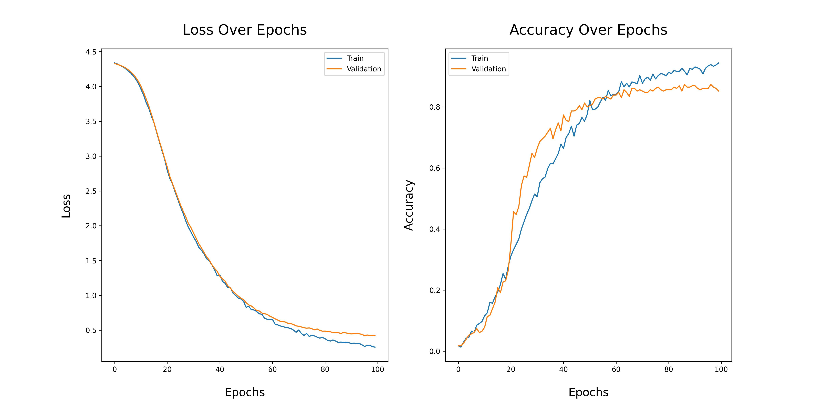

# 🤖 AI-Powered Customer Service Chatbot 🌟

The goal of this project is to provide quick and accurate answers to customer inquiries. The model is trained using a **Convolutional Neural Network (CNN)**, generating responses tailored to users' questions, all while enhancing customer service interactions. 

## 🌍 Who Can Benefit From It?

### 1. **E-Commerce Businesses**
   - Online retailers can leverage the chatbot to provide instant and accurate responses to customer inquiries, improving the overall shopping experience and boosting customer satisfaction.

### 2. **Customer Support Teams**
   - Customer service departments can automate repetitive tasks, allowing the team to focus on more complex issues, improving productivity, and reducing operational costs.

### 3. **Global Businesses**
   - Companies that serve international markets can provide **24/7 customer support** using the chatbot, ensuring that customer inquiries are answered even outside regular business hours.

### 4. **Growing Businesses**
   - Startups and growing companies can scale their customer service efficiently by using the chatbot to handle an increasing number of customer interactions without the need for a larger support team.

---

## 🚀 Why Is It Useful?

### 1. **Faster Response Times**
   - The chatbot provides instant answers, improving **response times** and ensuring customers receive timely assistance without waiting for human support agents.

### 2. **Cost-Effective Customer Support**
   - Automating responses for common queries significantly reduces the need for additional support staff, leading to **cost savings** while maintaining quality customer service.

### 3. **Improved Customer Experience**
   - With the use of **Natural Language Processing (NLP)**, the chatbot provides personalized and relevant responses, creating a more **engaging and interactive** customer experience.

### 4. **Data-Driven Insights**
   - Businesses can analyze chatbot interactions to gain valuable insights into **customer preferences and behavior**, helping make data-driven improvements in product offerings and services.

### 5. **Scalability**
   - The AI-powered chatbot allows companies to **scale their customer support operations** effortlessly, handling large volumes of inquiries during peak seasons or as the business grows.

### 6. **24/7 Availability**
   - By offering round-the-clock support, the chatbot ensures that no customer inquiry goes unanswered, providing **continuous service** regardless of time zone or business hours.

## 📊 Model History

## 🏷️ Tags
- 🤖 **Chatbot**
- 🌐 **Deep Learning**
- 🛒 **e-Commerce**
- 🧠 **Artificial Intelligence**
- 📈 **Machine Learning**
- 💬 **Customer Service**
- 🗣️ **Natural Language Processing (NLP)**
- ⚙️ **Automation**
- 👥 **User Experience (UX)**
